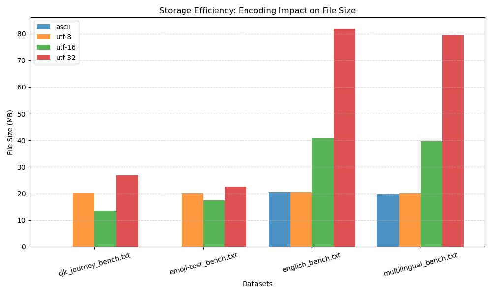
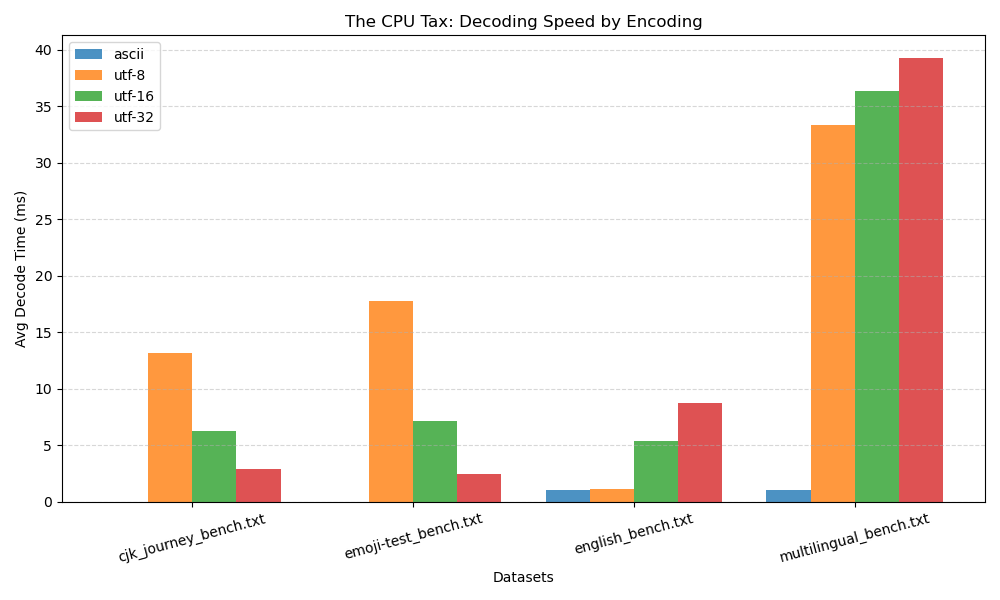
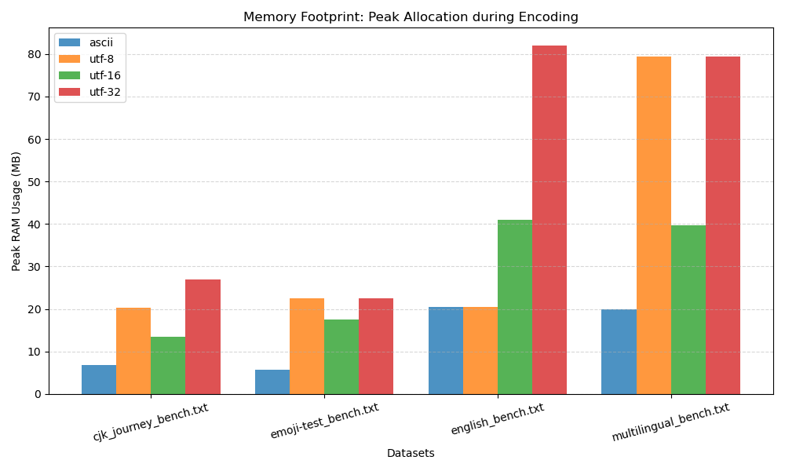

# 🔠 Character Encoding Analysis
### A Benchmarking Study of the CPython Runtime (v9.0)


> **"Moving beyond theoretical 'Big O' notation to isolate real-world behaviors."**

---

## 📂 Research Documentation
Detailed logs and scientific defenses for this project can be found here:

| [🧪 Methodology](docs/METHODOLOGY.md) | [📓 Research Journal](docs/JOURNAL.md) | [🔄 Changelog](docs/CHANGELOG.md) |
| :---: | :---: | :---: |
| *Experimental Design & Logic* | *Chronological Discovery Log* | *Version History (v1 - v9)* |

---

## 📝 1. Project Abstract
**Character Encoding Analysis** is a specialised performance engineering suite designed to empirically measure the computational, storage, and memory characteristics of text encodings (**ASCII**, **UTF-8**, **UTF-16**, **UTF-32**) within the Python 3.x environment.

This project utilises a custom-built benchmarking engine (`v9.0`) to isolate real-world behaviours. It employs byte-precise memory tracing (`tracemalloc`), adaptive CPU profiling, and standardised datasets to expose hidden costs such as the **UTF-8 Decoding Tax** and the **Multilingual Memory Spike**.

---

## 🔍 2. Executive Summary: Key Research Findings

Based on data collected from `v9.0` (nicknamed **Fancy & Adaptive**), we have isolated four critical performance phenomena.

### 🧠 (A) The "Multilingual Memory Spike" (New Discovery)
We uncovered a critical memory behaviour in the CPython interpreter (specifically related to **PEP 393**). When processing strings containing mixed scripts (e.g., English + Hindi + Chinese + Emoji), Python forces the internal string representation to the widest required character width (UCS-4/UTF-32) for the entire string to maintain *O(1)* indexing.

* **Observation:** Loading a **20 MB** mixed-language text file spiked RAM usage to **79.40 MB** (approx. 4x the file size), regardless of the target output encoding.
* **Implication:** Developers working with globalised datasets in Python must provision **400% RAM** relative to the raw text size.

### ⚡ (B) The "CPU Tax" is Context-Dependent
We discovered a massive divergence in decoding performance based on text complexity:

* 🐢 **Complex Text (Emoji/CJK):** UTF-8 is **~7.1x slower** than UTF-32. The CPU struggles with the bitwise validation required to parse variable-width characters.
* 🐇 **Simple Text (English):** UTF-8 is **~7x faster** than UTF-32. Since English characters are 1 byte in UTF-8, decoding is trivial, whereas UTF-32 bottlenecks on memory bandwidth.

### 🌏 (C) The CJK Storage Theorem
For datasets consisting primarily of Chinese, Japanese, or Korean (CJK) text, the industry-standard UTF-8 is mathematically inefficient.

* **Data Point:** Converting a CJK dataset from UTF-8 to UTF-16 reduced the file size by **33.3%** (`21.19 MB` --> `14.13 MB`).

### 🤝 (D) Backward Compatibility
Valid ASCII files processed as UTF-8 incurred **zero storage penalty** (a 1:1 byte ratio) and **zero performance penalty**, confirming UTF-8's robust backward compatibility as a superset of ASCII.

---

## 📊 3. Visualizations

*Below are the generated metrics from the v9.0 Benchmarking Suite.*

### 💾 Storage Efficiency

*(Comparisons of file size across different encoding schemes)*

### ⏱️ CPU Performance (Decode Speed)

*(Read/Write speeds comparing fixed-width vs variable-width encodings)*

### 🧠 Memory Usage

*(RAM consumption analysis showing the "Multilingual Memory Spike")*

---

## ⚙️ 4. Installation and Usage

### Prerequisites
* **Python 3.8** or higher
* `psutil` (System Monitoring)
* `matplotlib` (Chart Generation)

### Quick Start
The repository includes pre-configured sample datasets. To run the benchmark immediately:

1.  **Clone the Repository:**
    ```bash
    git clone [https://github.com/AvyakthS/Character-Encoding-Analysis](https://github.com/AvyakthS/Character-Encoding-Analysis)
    ```

2.  **Install Dependencies:**
    (for Debian/Ubuntu-based systems)
    ```bash
    sudo apt install python3-psutil python3-matplotlib
    ```

3.  **Run the Suite:**
    Navigate to the latest version and execute the script.
    ```bash
    cd "versions/script_v9_fancynadaptive"
    python3 script_v9_fancynadaptive.py
    ```

### The Output
The script will perform the following actions:
1.  **Auto-Prep:** Scan the `freesize` folder and generate standardised **20MB** test files.
2.  **Benchmark:** Run Adaptive I/O and CPU tests for ASCII, UTF-8, UTF-16, and UTF-32.
3.  **Visualise:** Generate PNG charts (`chart_storage.png`, `chart_cpu.png`) in the script folder.
4.  **Report:** Save a detailed text summary to `analysis_report.txt`.

---

## 🏗️ 5. Project Architecture

The project employs a **"Sandboxed Versioning"** architecture to preserve the evolutionary history of the research.

* **`versions/`**: Contains the evolutionary history of the script (v1 through v9).
* **`script_v9_fancynadaptive/`**: The current **Gold Standard** suite (Adaptive + Visuals).
* **`user_bench_files_freesize/`**: **Input Directory.** Users place raw `.txt` files here.
* **`user_bench_files_standardized/`**: **Artefact Directory.** The suite outputs normalised 20MB datasets here.
* **`docs/`**: Research documentation.

The full directory structure is given below:

### 📂 Project Directory Structure

```
/Character Encoding Analysis/
│
├── versions/                             # 📜 The Evolutionary Archive
│   ├── script_v1_prototype/              # Proof of Concept (Basic timing)
│   ├── script_v2_splitarch/              # Architecture Split (I/O vs CPU)
│   ├── script_v3_tracemalloc/            # Precision Memory (Switched to tracemalloc)
│   ├── script_v4_rwisolation/            # Variable Isolation (Read loop != Write loop)
│   ├── script_v5_sleekvisuals/           # Reporting (Box-drawing tables)
│   ├── script_v6_stablecore/             # The "Manual Config" Stable Release
│   ├── script_v7_versalitymeansutility/  # Auto-Discovery Features
│   ├── script_v8_fulltestsuite/          # (Auto-Prep + Analysis)
│   └── script_v9_fancynadaptive/         # 🏆 THE GOLD STANDARD
│       ├── script_v9_fancynadaptive.py   # The main execution script
│       ├── chart_storage.png             # (Generated) Storage Visualization
│       ├── chart_cpu.png                 # (Generated) Speed Visualization
│       └── analysis_report.txt           # (Generated) Text Report
│
├── user_bench_files_freesize/            # 📥 INPUT: User's raw text files go here
│   ├── english.txt
│   ├── multilingual.txt
│   ├── cjk_journey.txt
│   └── emoji-test.txt
│
├── user_bench_files_standardized/        # 📤 OUTPUT: Clean, 20MB normalized files appear here
│   ├── english.txt
│   ├── multilingual.txt
│   ├── cjk_journey.txt
│   └── emoji-test.txt
│
├── docs/                                 # 📘 Research Notes & Logs
│   ├── CHANGELOG.md                      # Version history
│   ├── METHODOLOGY.md                    # Scientific defense of the methods
│   └── JOURNAL.md                        # Key findings and research notes
│
└── README.md                             # Project Entry Point
```

---

## 👨‍💻 6. Author(s) & License
* **Author:** Avyakth Shriram.
* **License:** Open Source (MIT).